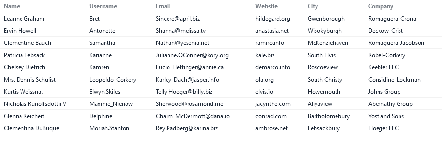
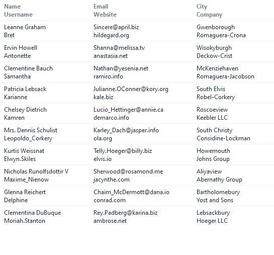

# Responsive Table

A simple tailwind (daisy ui) table that stacks content on smaller screens.  
The idea is to stack related items in the same column.  
This was made using Sveltekit v5.

## Screenshots

The full width table (larger screen)

The stacked table (smaller screen)

## Creating a project

clone, npm i
